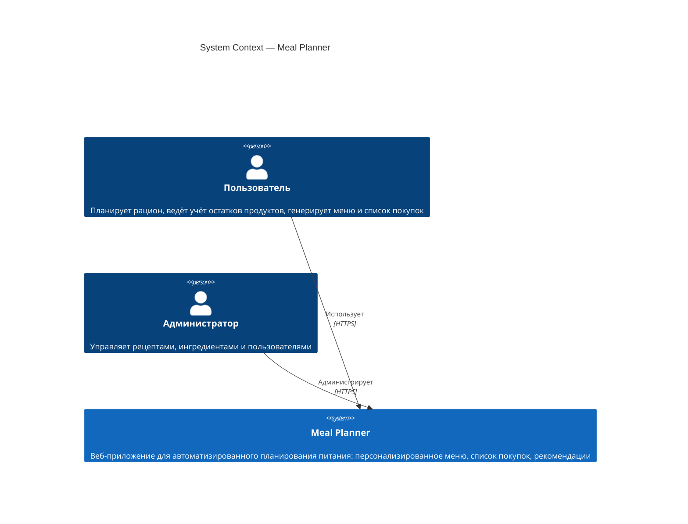

# C4 Level 1 — System Context

```mermaid
C4Context
    title System Context — Meal Planner

    Person(user, "Пользователь", "Планирует рацион, ведёт учёт остатков продуктов, генерирует меню и список покупок")
    Person(admin, "Администратор", "Управляет рецептами, ингредиентами и пользователями")

    System(mealPlanner, "Meal Planner", "Веб-приложение для автоматизированного планирования питания: персонализированное меню, список покупок, рекомендации")

    Rel(user, mealPlanner, "Использует", "HTTPS")
    Rel(admin, mealPlanner, "Администрирует", "HTTPS")

    UpdateLayoutConfig($c4ShapeInRow="2", $c4BoundaryInRow="1")
```

## Принятые допущения

- Внешние системы (SMTP для восстановления пароля, CDN для изображений) в скоуп не входят. 
